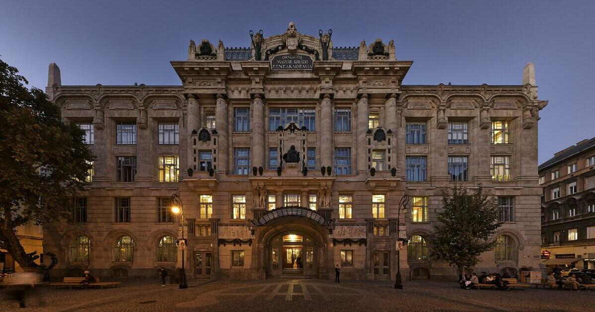

## Kolodko: Lecsó miniszobor

A **Lecsó miniszobor** egy humoros és szívmelengető alkotás **Kolodko Mihálytól**, amely a magyar konyha egyik legismertebb ételét, a lecsót idézi meg miniatűr formában. A szobor egy vidám, apró főzőedényt ábrázol, színes paprikák, paradicsomok és hagymák fortyognak, mintha éppen a tűzhelyről emelték volna le.

### A szobor mondanivalója
A Lecsó miniszobor a magyar gasztronómia és a közösségi étkezések örömét ünnepli. Ez a kis alkotás egyszerre nosztalgikus és játékos, emlékeztetve minket a családi ebédekre és a nyári piacok színes forgatagára. Kolodko ezzel a művével a hétköznapok egyszerű szépségét emeli művészi szintre.

### Hol található meg?
A Lecsó miniszobor jelenleg csak elképzelt alkotás, de ha Kolodko Mihály megformálná, akkor egy budapesti utcasarkon, piac közelében vagy egy Duna-parti sétányon bukkanhatnánk rá. Gyűjtők számára egyedi rendelésre is elkészül, hogy otthonukban őrizhessék ezt a magyar kincset.

Források: [Lecsó recept és története](https://hu.wikipedia.org/wiki/Lecsó), Kolodko Mihály miniszobrai

[Google Térkép link](https://maps.app.goo.gl/giNxYQm3Jrya1x2n)

---

## Az Operaház

A **Magyar Állami Operaház** egy impozáns neoreneszánsz stílusú épület Budapesten, amelyet **Ybl Miklós** tervezett.  
Az épület 1884 óta működik, és Magyarország egyik legismertebb kulturális intézménye. Az Operaház a klasszikus operák, balettek és más zenei előadások otthona.

[Operaház link: Wikipédia](https://hu.wikipedia.org/wiki/Magyar_Állami_Operaház)  
Az Operaház belső terét különleges akusztika és látványos díszítés jellemzi, a híres Aranyteremmel és a főhomlokzati oszlopcsarnokkal. A látogatók a gyönyörű belsőt is megtekinthetik az épület túrái során, vagy részt vehetnek egy-egy előadáson.

[Google térkép link](https://maps.app.goo.gl/Rw34JMFGxTXWMTB5A)
---

## A Zeneakadémia

A **Liszt Ferenc Zeneművészeti Egyetem**, közismert nevén **Zeneakadémia**, egy rangos zenei intézmény, amely 1875-ben alakult.  
Az épület **Steindl Imre** tervei alapján épült neogótikus stílusban, és az egyik legismertebb zenei iskola Magyarországon.

[Zeneakadémia link: Wikipédia](https://hu.wikipedia.org/wiki/Liszt_Ferenc_Zeneművészeti_Egyetem)  
A Zeneakadémia a zene és a művészetek iránt érdeklődők számára kulcsfontosságú helyszín. Az épület gyönyörű koncertterme és kulturális eseményei miatt a város egyik legfontosabb zenei központja.

[Google térkép link](https://maps.app.goo.gl/7wAfhF2FxrYFkZ9k9)

Források: Wikipédia, Google Térkép
