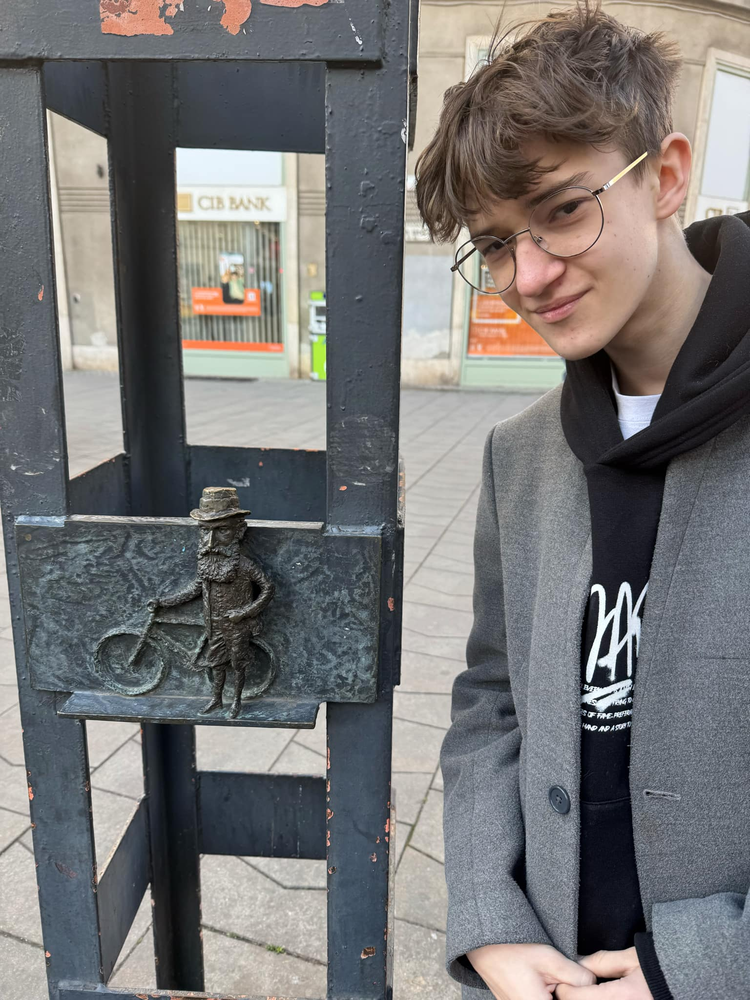

## Kolodko: Herzl Tivadar miniszobor

A **Herzl Tivadar miniszobor** egy apró, mégis jelentőségteljes alkotás **Kolodko Mihálytól**, amely a híres magyar származású cionista vezetőt, **Herzl Tivadart** ábrázolja. A szobor egy miniatűr vasúti kocsit formáz, amely Herzl híres fényképére utal: a fotón egy bécsi erkélyen állva tekint a távolba.

### A szobor jelentése
Herzl Tivadar a modern cionizmus egyik alapítója volt, és nagy hatással volt Izrael állam létrejöttére. Kolodko szobra játékosan, mégis tiszteletteljesen emlékezik meg róla, utalva arra az ikonikus pillanatra, amelyben Herzl a jövőt fürkészi.

### Hol található meg?
A miniszobor Budapest belvárosában, az egykori **Herzl tér közelében**, a Dohány utcai zsinagóga mellett található. Ez a helyszín nem véletlen, hiszen Herzl Tivadar ebben a városrészben született és nőtt fel.

Források: [Wikipédia - Herzl Tivadar](https://hu.wikipedia.org/wiki/Herzl_Tivadar), Kolodko Mihály miniszobrai  

[Google Térkép link](https://maps.app.goo.gl/Rw34JMFGxTXWMTB5A)

Dohány utcai zsinagóga
A Dohány utcai zsinagóga Európa legnagyobb és a világ második legnagyobb zsinagógája. 1859-ben épült mór stílusban, tervezője Ludwig Förster volt. A zsinagóga nemcsak vallási központ, hanem történelmi emlékhely is, mivel a holokauszt idején a budapesti gettó része volt.

Wikipédia link

A zsinagóga komplexumában található a Holokauszt Emlékpark, amely a vészkorszak áldozatainak állít emléket. Az épület és környéke Budapest egyik legjelentősebb kulturális és vallási központja.

Google térkép link

Rumbach utcai zsinagóga
A Rumbach utcai zsinagóga egy 1872-ben épült, keleties stílusú zsinagóga, amelyet Otto Wagner tervezett. Bár kisebb, mint a Dohány utcai zsinagóga, különleges építészeti megoldásai miatt Budapest egyik rejtett gyöngyszeme.

Wikipédia link

A zsinagóga a XX. század folyamán több funkciót is betöltött, de a közelmúltban felújították, és ma kulturális eseményeknek is otthont ad.

Google térkép link
