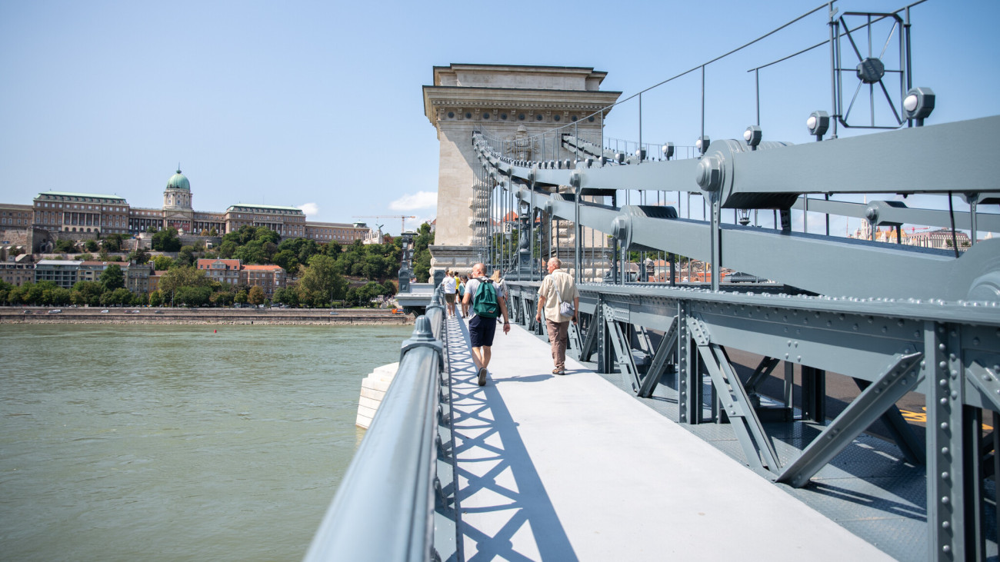

# Himbálózó Vuk miniszobor

A **Himbálózó Vuk** egy kedves és játékos miniszobor, amely a híres magyar mesehős, Vuk alakját örökíti meg, amint vidáman hintázik egy faágon. Az alkotás célja, hogy visszaadja a népszerű karakter pajkos természetét és a mese varázslatos világát.

## A szobor mondanivalója

A Himbálózó Vuk nemcsak egy dekorációs elem, hanem egy kedves emlékeztető arra, hogy a gyermeki játékosság és a természet szeretete örök értékek. Vuk figurája a szabadságot, a kíváncsiságot és a bátorságot jelképezi.

## Hol található meg?

A szobor egyedi alkotásként rendelhető, vagy alkalmanként kiállításokon is megtekinthető. Gyűjtők és meseimádók számára különleges darab lehet otthonukban vagy ajándékként.

**Források:** [Magyar mesék](https://hu.wikipedia.org/wiki/Vuk_(reg%C3%A9ny)), szobrászati gyűjtemények  
**Google Térkép link:** (Itt egy konkrét link hiányzik, kérlek, add meg, ha van!)

---

# Széchenyi Lánchíd

A **Széchenyi Lánchíd** Budapest ikonikus hídja, amely a Duna felett ível át, összekötve Pestet és Budát. Az 1849-ben átadott híd Magyarország első állandó hídja volt, és Széchenyi István kezdeményezésére épült.

A híd nemcsak mérnöki bravúr, hanem Budapest egyik szimbóluma is, amit esténként gyönyörűen kivilágítanak. A hídon sétálva a látogatók megcsodálhatják a Duna-parti panorámát, beleértve a Budai Várat és a Parlamentet. A híres oroszlánszobrok, amelyek a híd két végét őrzik, szintén különleges látványt nyújtanak.

**Helyszín:** Budapest, a Pest és Buda közötti Duna-szakasz  
**Lánchíd link:** [Wikipédia](https://hu.wikipedia.org/wiki/Sz%C3%A9chenyi_L%C3%A1nch%C3%ADd)

---

# Gellért-hegy és a Szabadság-szobor

A **Gellért-hegy** Budapest egyik legismertebb dombja, tetején a híres **Szabadság-szoborral**, amely a város fölé magasodik. A szobrot 1947-ben állították fel, és eredetileg a II. világháborús győzelem emlékére készült, de ma már a szabadság jelképeként ismert.

A Gellért-hegyről pazar kilátás nyílik a városra, a Dunára és a hidakra. A hegy zöldövezete tökéletes hely egy sétára, míg a szobor monumentalitása minden látogatót lenyűgöz. A hely történelmi és természeti szépsége miatt is kihagyhatatlan.

**Helyszín:** Budapest, XI. kerület, Gellért-hegy  
**Szabadság-szobor link:** [Wikipédia](https://hu.wikipedia.org/wiki/Szabads%C3%A1g-szobor_(Budapest))  
**Google Térkép link:** (Itt egy konkrét link hiányzik, kérlek, add meg, ha van!)  
**Források:** Wikipédia, Google Térkép
