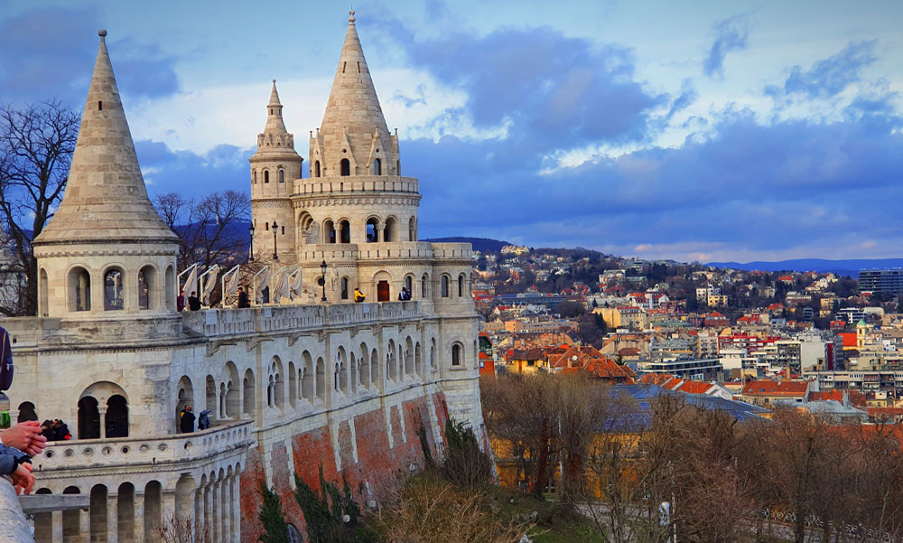

Kolodko Mihály gyermekként imádta a *Nagy ho-ho-ho horgász* rajzfilmsorozatot, és amikor 6 évvel ezelőtt Ungvárról Budapestre költözött, tudta, hogy ennek a kapcsolódásnak és gyermekkori kedvenc sorozatának az emlékére - elmondása szerint a *Nagy ho-ho-ho horgász* rajzfilmsorozatból tanult meg magyarul - szobrot fog készíteni. 

Ez a miniszobor lett a Főkukac, melynek végleges helyszíne egy hétvégi, gyermekével történt Duna-parti sétája során vált egyértelművé. És, hogy miért ide került a Főkukac..? A Duna és a halak csak egy „dobásnyira” vannak.

**Helyszín:** Budapest Bem rakpart, Batthyány tér és Lánchíd közötti útszakasz.

:# Parlament

A **Magyar Országház**, közismert nevén **Parlament**, Budapest egyik legismertebb épülete.  
A neogótikus stílusú épület 1902-re készült el, és a világ harmadik legnagyobb parlamenti épülete. 

Parlament link:https://hu.wikipedia.org/wiki/Orsz%C3%A1gh%C3%A1z
A Duna partján álló épület a magyar törvényhozás székhelye, és a város egyik legfontosabb nevezetessége, amely a látogatók számára vezetett túrák során is felfedezhető.  
Impozáns belső terét és az Országgyűlés munkáját a helyszínen is megismerhetjük.

:# Halászbástya

A **Halászbástya** Budapest egyik legismertebb és legszebb kilátópontja, a Budai Várnegyedben található.  
A 19. század végén épült neoromán stílusban, és a város egyik legismertebb turistalátványossága.  

Halászbástyja link:https://hu.wikipedia.org/wiki/Hal%C3%A1szb%C3%A1stya
A bástyáról gyönyörű panoráma nyílik Budapest belvárosára, a Dunára és a Parlamentre.  
A Halászbástya különlegességei közé tartoznak a mesébe illő tornyai és a teraszai, amelyek a látogatók számára lenyűgöző kilátást biztosítanak.

Google térkép:
https://maps.app.goo.gl/qCJCEAbG6BrjWvwT7
Források:Wikipédia,Google térkép

