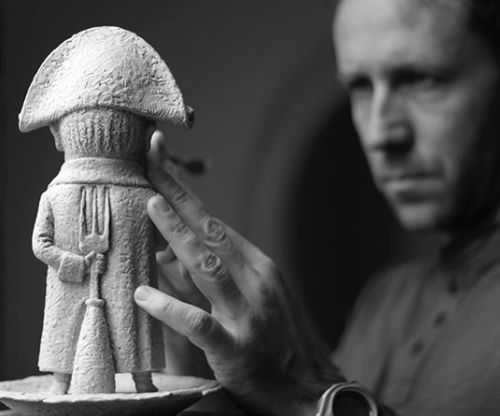

# Kolodko Mihály élete és munkássága

**Kolodko Mihály** a kortárs magyar szobrászat egyik meghatározó alakja, aki különleges miniszobrokkal vált ismertté. Munkásságában a kis méretű szobrok, amelyek gyakran a városi környezetben jelennek meg, kiemelkedő szerepet kapnak. Az alkotásaiban a minimalizmus és a részletgazdag kidolgozás ötvöződik, miközben az egyes művek valamilyen társadalmi, kulturális vagy történelmi vonatkozással bírnak.

Kolodko Mihály pályafutása nemcsak a szobrászati világban, hanem a városi művészetek körében is figyelmet keltett. Egyik legismertebb műve, a **Főkukac** miniszobra a híres **Nagy ho-ho-ho horgász** című meséből származik, amely a gyermekek számára egy szimbolikus találkozási pontot jelentett a művészet és a popkultúra között. Az ő alkotásai számos városban megjelentek, gyakran titokban, rejtett helyeken, hogy a felfedezők örömmel találják meg őket.

A művész munkásságának központjában mindig is az volt, hogy a művészet könnyen hozzáférhető legyen mindenki számára, ezért választott olyan helyszíneket a szobrok számára, mint például parkok, terek vagy éppen forgalmas utcák. A **Rubik-kocka** miniszobra, amely Budapest szívében található, szintén a művész egyik legismertebb alkotása, amely a magyar kreativitás egyik szimbólumát ünnepli.

Kolodko Mihály művészete nemcsak a formák és színek harmóniáját, hanem a mélységet is közvetíti. A szobrok nemcsak látványosak, hanem mélyebb jelentéseket is hordoznak, amelyek elgondolkodtatják a nézőt a társadalmi és kulturális kérdésekről. A művész életműve példa arra, hogyan lehet a művészetet mindennapi életünk részévé tenni, miközben a kreativitás határait feszegetjük.

## 1.3 Forrásgyűjtemény

1. **Kolodko Mihály hivatalos weboldal** 
2. **"Kolodko Mihály - Művészet és társadalom" című cikk**
3. **"Miniszobrok és városi művészetek: Kolodko Mihály"**
4. **Budapesti Városi Művészetek: A miniszobrok hatása**
5. **Interjú Kolodko Mihállyal**

8 db kis kép 500 px legyen

    
|----------------------------------|---------------------------------|

