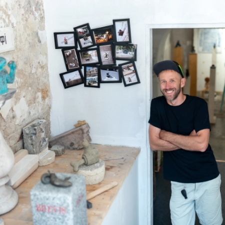
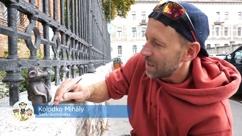
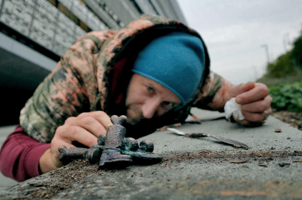
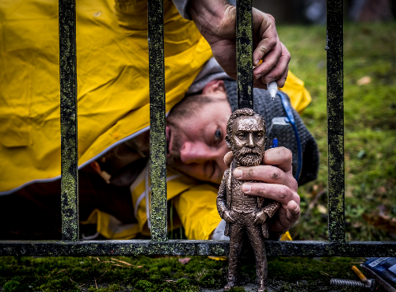
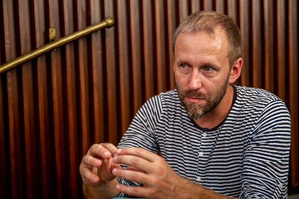
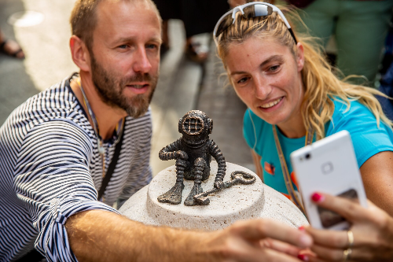

# Kolodko Mihály élete és munkássága

**Kolodko Mihály** a kortárs magyar szobrászat egyik meghatározó alakja, aki különleges miniszobrokkal vált ismertté. Munkásságában a kis méretű szobrok, amelyek gyakran a városi környezetben jelennek meg, kiemelkedő szerepet kapnak. Az alkotásaiban a minimalizmus és a részletgazdag kidolgozás ötvöződik, miközben az egyes művek valamilyen társadalmi, kulturális vagy történelmi vonatkozással bírnak.

Kolodko Mihály egy magyar szobrász, aki a modern köztéri szobrászat egyik kiemelkedő alakja. Munkássága során számos olyan művet alkotott, amelyek a mindennapi élet egyszerű, de jelentőségteljes pillanatait örökítik meg. A művész különösen híres a kis szobrok elhelyezéséről, amelyek gyakran meglepő helyeken tűnnek fel, mint például városi terek, buszmegállók vagy parkok. Ezen szobrok nem csupán esztétikai értéket képviselnek, hanem fontos társadalmi és filozófiai kérdéseket is felvetnek.

A Kolodko-szobrok különlegessége abban rejlik, hogy miközben a köztereken jelennek meg, nemcsak a városkép gazdagítására szolgálnak, hanem interaktív élményt is adnak a közönség számára. Az alkotások nem statikus műalkotások, hanem élő, dinamikus elemek, amelyek új perspektívákat és párbeszédeket indítanak el a városlakók körében. Az ilyen típusú szobrok mindenképpen eltérnek a hagyományos szobrászati formáktól, és új irányokat jelölnek ki a kortárs művészetben.

Kolodko Mihály híres munkái közé tartozik például a "Mr. Bean" figura, amely nemcsak a művész saját stílusának, hanem egy globálisan ismert karakter, Rowan Atkinson híres komikus alteregójának is megjelenítése. Ez a szobor olyan apró részletekben gazdag, hogy szinte életre kel a figura, és lehetőséget ad a közönség számára, hogy egy pillanatra kapcsolatba lépjen vele. A művész ezen alkotása példázza azt a sajátos látásmódot, amely Kolodko munkáit jellemzi: a szobor nem csupán egy tárgy, hanem egy történet, egy kapcsolat, amely interakciót kíván a nézőkkel.

A művész szobrait gyakran nemcsak a közönség szemléli, hanem a városi táj is részévé válik. Kolodko szobrászati alkotásai szorosan összefonódnak a város életével, és segítenek elgondolkodtatni a városi környezet jelentőségéről, illetve a közterek szerepéről a társadalomban. A szobrok nem csupán dekorációk, hanem egy-egy történetet mesélnek el, és egy új dimenziót adnak a városi térnek.

Munkássága során Kolodko Mihály számos elismerést kapott, és mára nemcsak Magyarországon, hanem nemzetközi szinten is elismert művészé vált. Művei megjelennek különböző kiállításokon és városi rendezvényeken, és folyamatosan inspirálják a kortárs művészeti közösséget. Munkái nemcsak esztétikai értéket képviselnek, hanem a társadalom aktuális problémáira és kérdéseire is reflektálnak, ezáltal a művészete mindig is fontos szereplője volt és lesz a kulturális diskurzusnak.

Kolodko Mihály tehát nemcsak szobrászként, hanem a városi táj formálásában is kiemelkedő szereplő. Munkái nem csupán a művészeti közönség számára érdekesek, hanem mindenki számára, aki a városban él vagy látogat. Az ő művei folyamatosan jelen vannak a városokban, és mindenki számára elérhetők, akik egy kis szépítést és elgondolkodtató művészetet keresnek a mindennapi életben.
 

 

 

  

