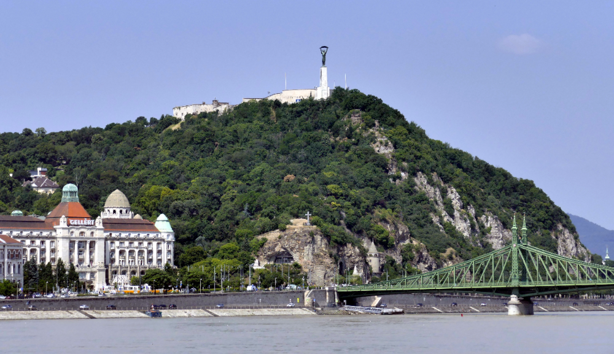

# Gellért-hegy és fürdő

A **Gellért-hegy** Budapest egyik legismertebb hegyvidéki területe, amely a város szívéből, a Duna mentén emelkedik. A hegy tetején található a **Szabadság-szobor**, amely Budapest egyik legismertebb szobraként a szabadságot és a függetlenséget szimbolizálja.

Az **Gellért Fürdő** és a híres **Gellért Szálló** is itt találhatóak, melyek az art deco stílusú építészet remekei és Budapest híres termálvizes fürdői közé tartoznak. A Gellért-hegyről csodálatos kilátás nyílik a városra, különösen a Duna, a Széchenyi lánchíd és a Budai Vár irányába.

