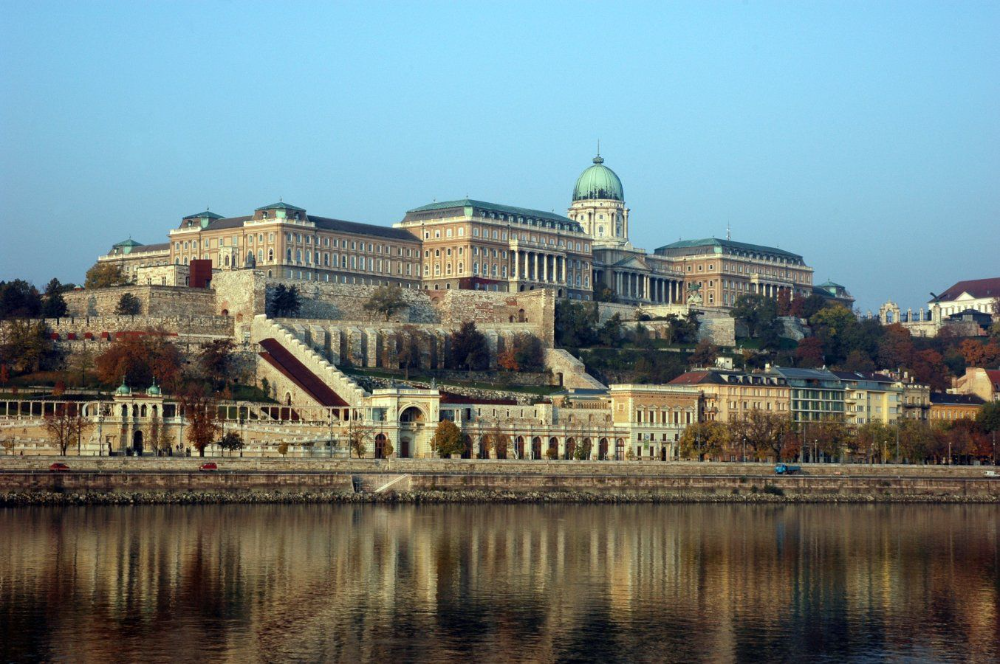

# Budai Vár

A **Budai Vár** Budapest egyik legismertebb történelmi helyszíne, amely a 13. században épült. A vár az UNESCO Világörökség része, és számos fontos intézménynek ad otthont, mint a **Magyar Nemzeti Galéria** és a **Történeti Múzeum**.

A várudvarból csodálatos kilátás nyílik a városra és a Dunára. A **Halászbástya** és a **Mátyás-templom** is a vár területén találhatóak.

