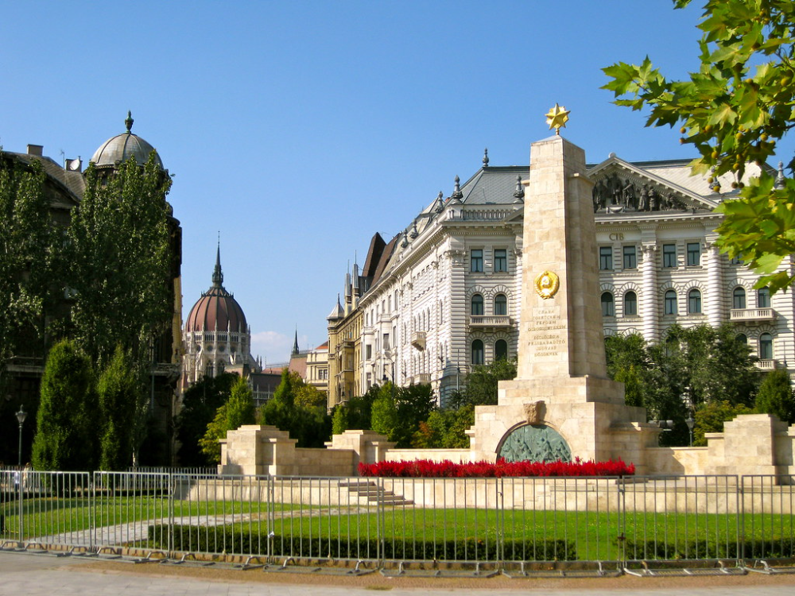

# Szomorű tank Szobor

A **szomorú tankszobor** egy kis méretű műalkotás, amely a koldulás vagy szegénység témáját ábrázolja. Az ilyen szobrok gyakran szociális vagy társadalmi problémákat emelnek ki, mint a társadalmi kirekesztettség, szegénység és emberség.

## Története

A művész az alakokat részletesen formálja meg, hogy tükrözze a koldusok szenvedését, reménykedését vagy kétségbeesését. E szobrok története nem feltétlenül egy-egy személyhez kapcsolódik, hanem inkább egy általános társadalmi problémát, a kirekesztést és a szegénységet ábrázolja.

## Célja

Az ilyen műalkotások célja, hogy felhívja a figyelmet a társadalmi egyenlőtlenségekre és érzékenyítse a közönséget a szociális kérdések iránt.

---

# Szabadság tér

[Szabadság tér link](https://hu.wikipedia.org/wiki/Szabads%C3%A1g_t%C3%A9r_(Budapest))

A **Szabadság tér** Budapest belvárosában, a **Duna** partján található, és jelentős történelmi és politikai események színhelye volt. A tér központjában áll a **Szovjet Emlékmű**, amely a második világháborúban elhunyt szovjet katonák előtt tiszteleg.

A tér közelében található a **Parlament** és a **Szent István-bazilika**. Ma a Szabadság tér nemcsak történelmi emlékeket őriz, hanem élénk központ is, gyakori helyszíne rendezvényeknek és demonstrációknak.

---

# Andrássy Út

Az **Andrássy Út** Budapest egyik legismertebb sugárútja, amely 2002 óta az UNESCO Világörökség része. Az utat 1872 és 1886 között építették, és számos fontos épület található rajta, például a híres **Operaház** és a **Hősök Tere**.

[Andrássy Út link](https://hu.wikipedia.org/wiki/Andr%C3%A1ssy_%C3%BAt)

A sugárút különleges hangulata és történelmi jelentősége miatt a turisták egyik kedvelt célpontja.

[Google térkép link](https://maps.app.goo.gl/ocbBJrcm8xdobizPA)

---

Források: Wikipédia, Google térkép
