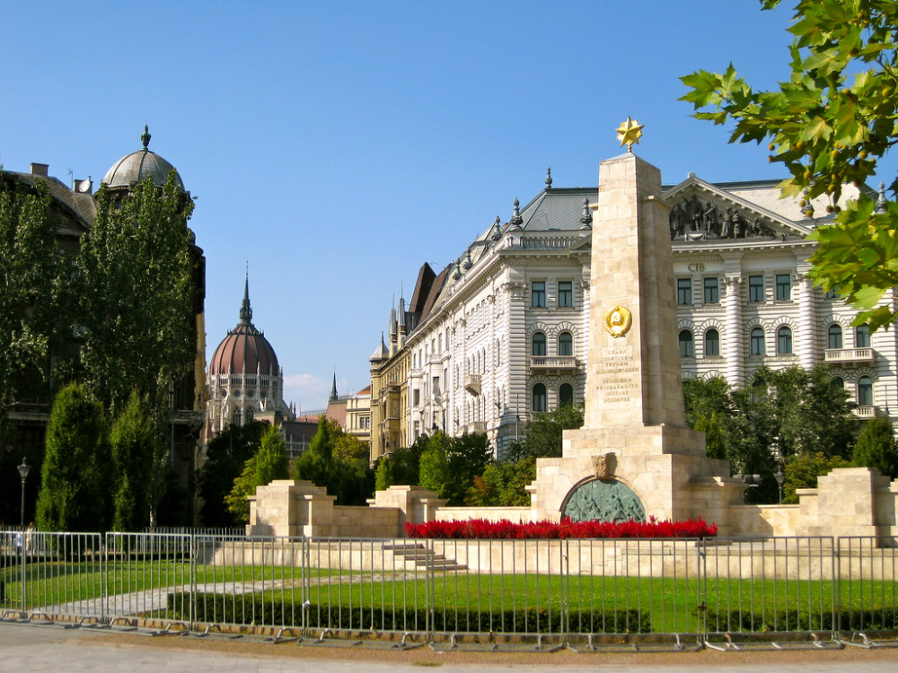

# Szabadság tér

A **Szabadság tér** Budapest belvárosában, a **Duna** partján található, és jelentős történelmi és politikai események színhelye volt. A tér központjában áll a **Szovjet Emlékmű**, amely a második világháborúban elhunyt szovjet katonák előtt tiszteleg.

A tér közelében található a **Parlament** és a **Szent István-bazilika**. Ma a Szabadság tér nemcsak történelmi emlékeket őriz, hanem élénk központ is, gyakori helyszíne rendezvényeknek és demonstrációknak.

