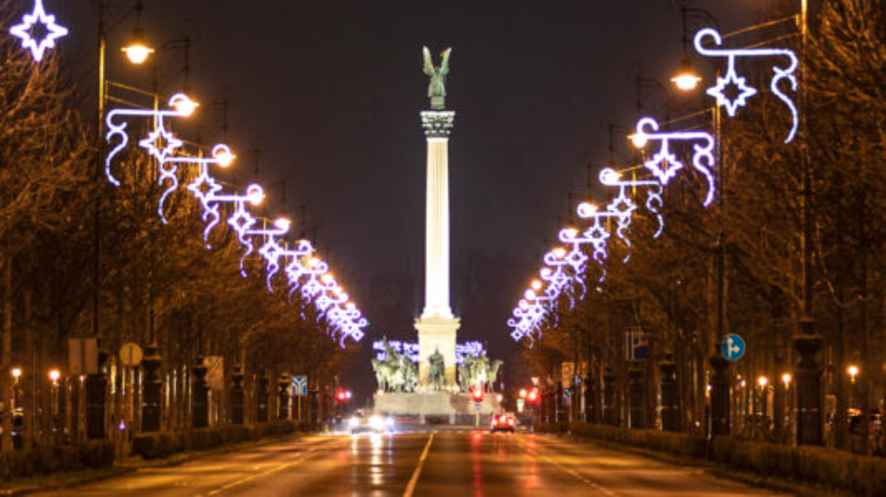

# Andrássy Út

Az **Andrássy Út** Budapest egyik legismertebb sugárútja, amely 2002 óta az UNESCO Világörökség része. Az utat 1872 és 1886 között építették, és számos fontos épület található rajta, például a híres **Operaház** és a **Hősök Tere**. 

A sugárút különleges hangulata és történelmi jelentősége miatt a turisták egyik kedvelt célpontja.

